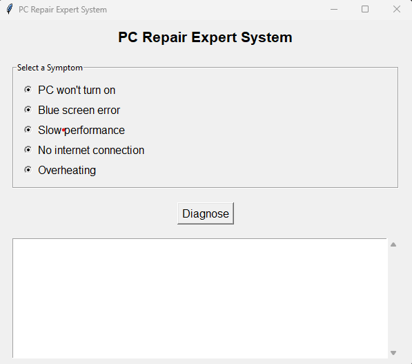

# PC Repair Expert System


The **PC Repair Expert System** is a Python-based application designed to help users diagnose and troubleshoot common PC issues. It provides step-by-step solutions and references to guides, videos, and articles for further assistance. The program features a user-friendly GUI built using the `tkinter` library.

---

## Features

- **Symptom Selection**: Choose from a list of common PC issues (e.g., "PC won't turn on," "Blue screen error").
- **Diagnosis**: Get actionable solutions for the selected symptom.
- **References**: Access links to guides, videos, and articles for additional help.
- **User-Friendly Interface**: Built with `tkinter` for a clean and intuitive experience.
- **How to Use Guide**: Includes instructions on how to interact with the program.

---

## Screenshots


*Main Window with Symptom Selection*


*Diagnosis Results with References*

---

## Installation

1. **Clone the Repository**:
   ```bash
   git clone https://github.com/your-username/pc-repair-expert-system.git
   cd pc-repair-expert-system
